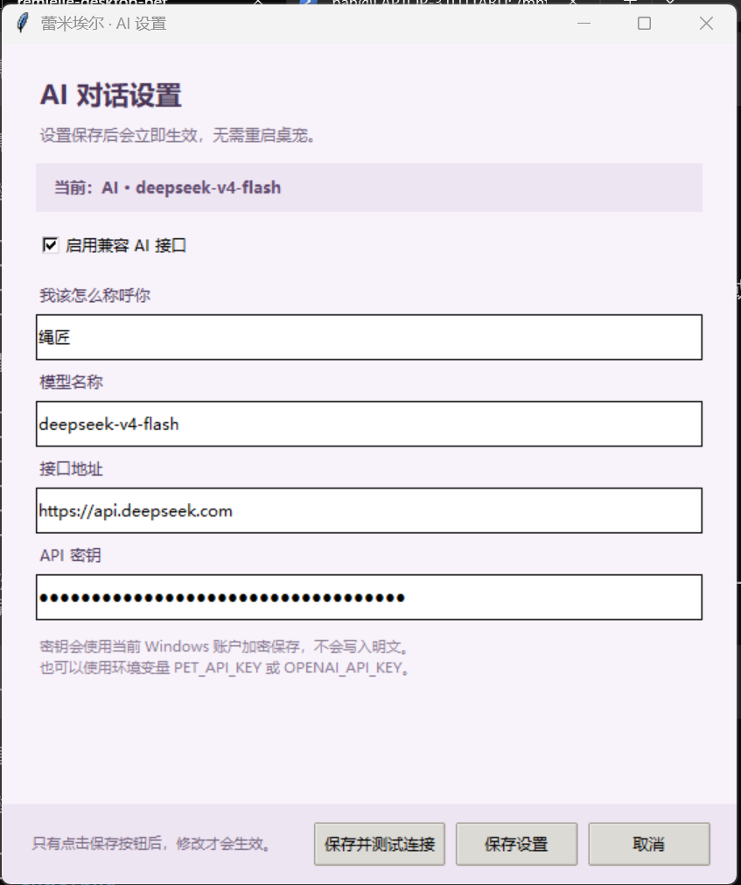
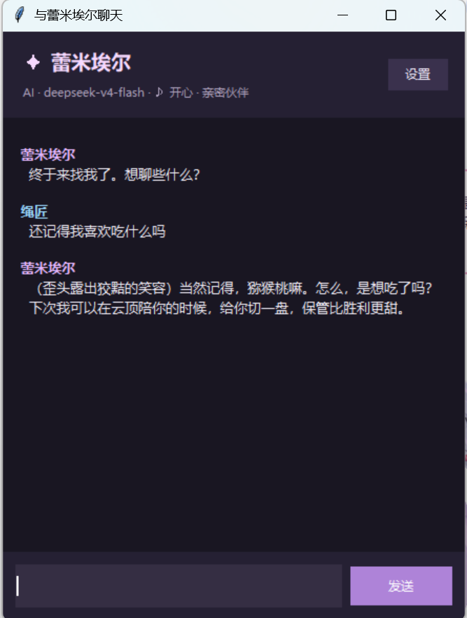
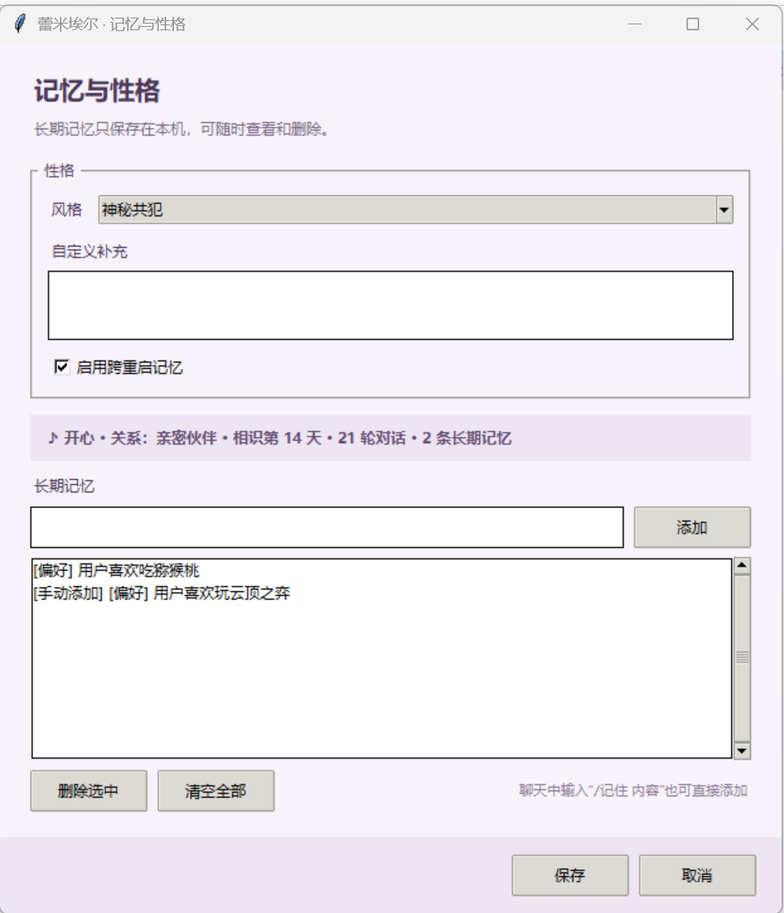

<div align="center">
  

# 蕾米埃尔 AI 桌面宠物

**会记住你、感知对话氛围，也能完全离线陪伴的 Windows 桌宠。**

[**下载 Windows 便携版**](https://github.com/AlphaBuilderF1/remielle-desktop-pet/releases/download/v0.3.0/RemielleDesktopPet-v0.3.0-Windows-x64.zip)
· [查看 Release](https://github.com/AlphaBuilderF1/remielle-desktop-pet/releases/tag/v0.3.0)
· [校验文件](https://github.com/AlphaBuilderF1/remielle-desktop-pet/releases/download/v0.3.0/RemielleDesktopPet-v0.3.0-Windows-x64.zip.sha256.txt)

Windows 10/11 x64 · v0.3.0 · 无需安装 Python
</div>

> 本项目是以《绝区零》蕾米埃尔·丹为灵感制作的非官方、非商业同人作品，与原作开发商、发行商及其关联方无关。详见《[开源与权利说明](RIGHTS.md)》。

## 核心特点

- **离线也能玩**：默认使用内置陪伴台词，不配置 AI 也能拖动、互动、眨眼和播放待机动作。
- **接入自己的 AI**：支持兼容 `POST /v1/chat/completions` 的接口，可自定义模型、接口地址和称呼。
- **记忆与性格**：支持长期记忆管理、最近对话、三种性格预设和自定义性格要求。
- **对话氛围与关系反馈**：在本地识别明确的对话语气，调整状态文字、气泡颜色、台词和回复风格，不进行心理或医学判断。

## 快速开始

1. 下载 [`RemielleDesktopPet-v0.3.0-Windows-x64.zip`](https://github.com/AlphaBuilderF1/remielle-desktop-pet/releases/download/v0.3.0/RemielleDesktopPet-v0.3.0-Windows-x64.zip)。
2. 完整解压 ZIP，不要直接在压缩包中运行。
3. 双击 `蕾米埃尔桌宠.exe`。
4. 如果 Windows 显示“未知发布者”，请确认文件来自本项目 Release，并使用随附的 SHA-256 文件核对完整性。

### 基本操作

| 操作 | 功能 |
| --- | --- |
| 拖动角色 | 移动桌宠位置 |
| 单击角色 | 显示一句新台词 |
| 双击角色 | 打开聊天窗口 |
| 右键角色 | 打开聊天、记忆、AI 设置和退出菜单 |

## 接入 AI

1. 右键角色，选择“设置 AI”。
2. 勾选“启用兼容 AI 接口”。
3. 填写模型名称、接口地址和 API 密钥。
4. 点击“保存并测试连接”，然后双击角色开始聊天。

<table>
  <tr>
    <td align="center" width="50%">
      <a href="docs/images/screenshots/ai-settings.png"></a><br>
      <strong>AI 设置</strong><br>
      <sub>自定义模型、接口地址与连接测试</sub>
    </td>
    <td align="center" width="50%">
      <a href="docs/images/screenshots/chat.png"></a><br>
      <strong>AI 聊天</strong><br>
      <sub>对话状态、氛围反馈与记忆参考</sub>
    </td>
  </tr>
</table>

<p align="center"><sub>点击截图可查看原图。</sub></p>

API 密钥使用 Windows DPAPI 与当前登录账户绑定加密，不以明文写入配置。也可以使用 `PET_API_KEY` 或 `OPENAI_API_KEY` 环境变量。

> [!IMPORTANT]
> 启用 AI 后，对话上下文和已启用的记忆会直接发送给你配置的第三方接口；后台补充主动台词缓存也可能产生请求和费用。请只使用可信的 `https://` 接口，并阅读《[隐私说明](PRIVACY.md)》。

## 记忆、性格与情绪

在右键菜单中选择“记忆与性格”，可以：

- 切换“神秘共犯”“温柔陪伴”“理性督促”，或填写自定义性格。
- 查看、手动添加或删除长期记忆；聊天中也可输入 `/记住 内容`。
- 开关跨重启记忆，清空长期记忆和最近对话。
- 查看相识天数、对话次数和当前关系阶段。

<p align="center">
  <a href="docs/images/screenshots/memory-management.png"></a><br>
  <strong>记忆与性格管理</strong><br>
  <sub>性格预设、长期记忆、对话次数与关系阶段</sub>
</p>

本地情绪识别包括“平静、开心、关心、专注、倦意”，不会额外发起模型请求。关系阶段仅用于调整回复的熟悉程度，不会用冷落、内疚或依赖感要求用户继续互动。

## 问题反馈

- [报告 Bug](https://github.com/AlphaBuilderF1/remielle-desktop-pet/issues/new?labels=bug&title=%5BBug%5D%20)
- [提交功能建议](https://github.com/AlphaBuilderF1/remielle-desktop-pet/issues/new?labels=enhancement&title=%5BFeature%5D%20)
- [查看已有 Issues](https://github.com/AlphaBuilderF1/remielle-desktop-pet/issues)

报告问题时，请尽量附上 Windows 版本、复现步骤和错误提示。**请勿公开 API 密钥、`config.json`、`memory.json`、私密对话或未经检查的启动日志。**

## 从源码运行

需要 Windows 与 Python 3.10 或更高版本。克隆仓库后，双击 `启动蕾米埃尔.bat`，或运行：

```powershell
python main.py
```

运行基础自检：

```powershell
python main.py --self-test
```

### 构建 Windows 便携版

```powershell
python -m pip install pyinstaller
powershell -ExecutionPolicy Bypass -File packaging\build_portable.ps1
```

构建脚本会先运行自检，再在 `release/` 中生成 ZIP 和对应的 SHA-256 文件。便携包不包含本地配置、记忆、API 密钥或开发文件。

## 开源、权利与隐私

- 项目维护者原创的源代码使用 [MIT License](LICENSE)。
- 角色、名称、商标和 `assets/` 美术素材不在 MIT License 授权范围内，详见 [RIGHTS.md](RIGHTS.md)。
- 本地数据、AI 接口传输和删除方式详见 [PRIVACY.md](PRIVACY.md)。

## 项目结构

- `main.py`：启动入口与基础自检。
- `remielle_pet/app.py`：桌宠主窗口、点击、拖动、气泡与台词缓存。
- `remielle_pet/chat.py`：AI 聊天窗口。
- `remielle_pet/memory.py`：本地记忆、情绪和关系阶段。
- `remielle_pet/memory_ui.py`：记忆与性格管理窗口。
- `remielle_pet/settings.py`：AI 设置与连接测试。
- `remielle_pet/ai.py`：在线请求与离线回复。
- `remielle_pet/config.py`、`security.py`：配置读写与 Windows 密钥加密。

---

<div align="center">
  如果你喜欢这个项目，欢迎 Star，也欢迎通过 Issues 分享使用体验。
</div>
